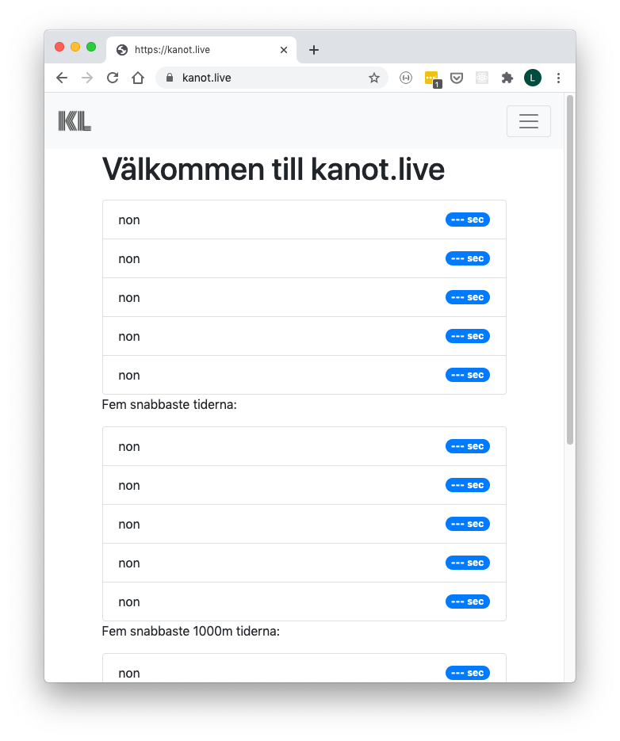
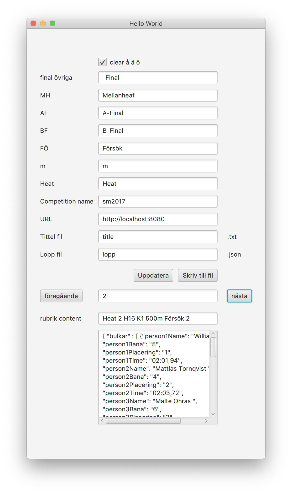
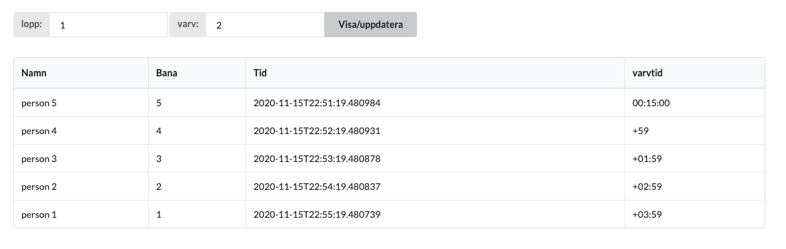

  

<h3 align="center">Kanot.live ekosystemt</h3>

<!---
   
   
  
  
  
--->

 En skara applikationer för att hantera data inom slätvatten tävlingar.
      

## 🧐 Min tanke 
När jag skapat kanot.live var det för att jag såg att det fanns ett stor luka i data i form starlistor, resultat osv. Vilket jag ville lösa

Detta för först för att kunna visa upp detta för tävlande och åskådare i ett första skede vilket nu kan göras genom kanot.live. 

Det andra är att tillgänligöra det för att kunna andvändas till annat likt speaker, livestream och mycket mer. Utan att alla ska behöva bygga "grunden" i hur data hämtas ut från systemen och skickas vidare till de olika applikationerna.
Så helt enkelt bli av med papper och dessa PDF filer.

Detta med att det ska vara enklet och smidigt då det finns API:er och data sparas i en mordern och "vettigt" designad databas där alla delar går att skala både i andvändare och tävlande osv.

Där det stora målet är att göra det lättare och smidigare för tävliande, arangörer, åskådare samt för oss aktiva som vill göra mer! 

## 💡 Grunden 
Grunden i detta är att det finns en applikation 
[💾  tävlings applikation](https://github.com/flaime/ResultatTavalaKanot)

Som man startar på datorn som kör tävlingsprogramet. Där det suger ut alla data och skickar det regelbundet till en applikation i målnet som håller alla data uppdatera.

första versionen av dokumentation om hur man kan hämta data finns [här](https://flaime.github.io/canoeWebApiDoc) (under konstruktion)
## Applikationen

### kanot.live
Primära funktionen som kan visa start och resultat. Editera och konfigurera mycket av datan. Ta emot protester och mycket mer. Kan hittas [här](https://kanot.live).

### Livestream 
En applikation för att hämta och integrera data till och i livestream. Denna har ett gui för att exemplvis enkelt kunna hämta och uppdatera loppdata. 
Det den kräver är att veta URL:en till kanot.live och sedan får man välja vilket lopp och så kommer den skapa och uppdatera de två filerna man valt. 
Man kan där också se vad som skrivs till de två filerna och modifiera det om man vill genom att editera texten och sen updatera.

Kan hittas [här](https://github.com/flaime/CanoeLiveStream)
 

Exempel på filerna:
- [title.txt](exampleFiles/title.txt)
- [lopp.json](exampleFiles/lopp.json)

### Maraton/långlopp
Mitt senaste prodekt är att kunna få ut lopptider. Så man kan få upp hur lång efter alla ligger. Typ klart GUI för att mata in skulle behöva uppdateras lite.

En del av vad applikationen kan visa. Kan visa lopp och annat också samt ett litet admin interface.
Den är mest tänkt för att andvändas till en livestream.

Kan hittas [här](https://github.com/flaime/CanoeLiveStream) 